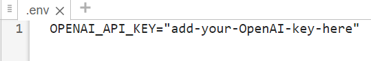
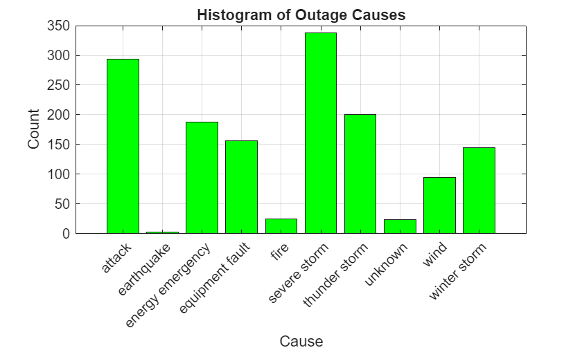
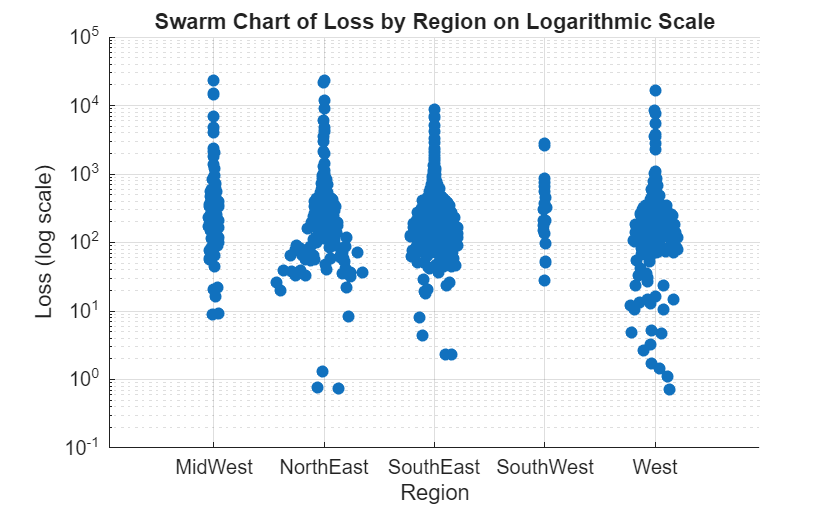

# Visualize Table Data Using ChatGPT

This example shows how to generate MATLAB® visualizations for tabular data using ChatGPT™. 

- Build a prompt that describes table data to ChatGPT.
- Generate MATLAB code that creates visualizations using ChatGPT.
- Request user approval before running LLM\-generated code.

# Setup

Using the OpenAI® API requires an OpenAI API key. For information on how to obtain an OpenAI API key, as well as pricing, terms and conditions of use, and information about available models, see the OpenAI documentation at [https://platform.openai.com/docs/overview](https://platform.openai.com/docs/overview).

To connect to the OpenAI API from MATLAB using LLMs with MATLAB, specify the OpenAI API key as an environment variable and save it to a file called ".env".



To connect to OpenAI, the ".env" file must be on the search path.

Load the environment file using the `loadenv` function.

```matlab
loadenv(".env")
```

# Visualize Table Data

Create a table containing data that represents electric utility outages in the United States.

A sample of this dataset will be sent to the AI model as part of the system prompt.

```matlab
outages = readtable("outages.csv");
```

You can generate visualization code for the table by prompting ChatGPT through the `generateVisualizationCodeUsingChatGPT` function, which is defined at the bottom of this example. For example, use ChatGPT to create a histogram with custom properties.

```matlab
code = generateVisualizationCodeUsingChatGPT(outages,"gpt-4.1-mini", ...
    "Create a histogram of outage causes with green bars.")
```

```matlabTextOutput
code = 
    'causeData = T.Cause; % Extract Cause data
     % Remove empty or missing values if any
     causeData = causeData(~cellfun('isempty', causeData));
     
     % Create bar histogram of outage causes
     figure;
     categoryCounts = groupcounts(categorical(causeData));
     categories = categories(categorical(causeData));
     bar(categoryCounts, 'FaceColor', 'g');
     set(gca, 'XTickLabel', categories, 'XTickLabelRotation', 45);
     title('Histogram of Outage Causes');
     xlabel('Cause');
     ylabel('Count');
     grid on;'


```

Validate the code by reviewing it in a dialog, then run the code to generate the visualization.

```matlab
runGeneratedCodeWithApproval(code,outages)
```



Use ChatGPT to calculate and plot outage durations, and highlight notable events.

```matlab
code = generateVisualizationCodeUsingChatGPT(outages,"gpt-4.1-mini", ...
    "Plot power outage durations on a logarithmic scale " + ...
    "and indicate which events affected more than one million customers.")
```

```matlabTextOutput
code = 
    '
     % Calculate outage durations in hours
     validRestorationIdx = ~ismissing(T.RestorationTime); % Exclude missing RestorationTime
     validOutageTimeIdx = ~ismissing(T.OutageTime);
     validIdx = validRestorationIdx & validOutageTimeIdx;
     outageDurations = hours(T.RestorationTime(validIdx) - T.OutageTime(validIdx));
     
     % Filter Customers values corresponding to valid durations
     customers = T.Customers(validIdx);
     
     % Handle missing Customers by setting to 0 (or can exclude)
     customersFilled = customers;
     customersFilled(ismissing(customersFilled)) = 0;
     
     % Identify events affecting more than one million customers
     largeImpactIdx = customersFilled > 1e6;
     
     % Prepare figure
     figure;
     hold on;
     
     % Scatter plot of all outage durations on log scale (x axis: event index, y axis: duration)
     allIndices = 1:length(outageDurations);
     scatter(allIndices(~largeImpactIdx), outageDurations(~largeImpactIdx), 15, 'b', 'filled');
     
     % Highlight large impact events in red
     scatter(allIndices(largeImpactIdx), outageDurations(largeImpactIdx), 30, 'r', 'filled');
     
     % Set y-axis to log scale
     set(gca, 'YScale', 'log');
     
     % Labels and title
     xlabel('Event Index');
     ylabel('Outage Duration (hours, log scale)');
     title('Power Outage Durations with Events Affecting >1 Million Customers Highlighted');
     legend({'Other Events', '>1 Million Customers Affected'}, 'Location', 'best');
     grid on;
     hold off;'


```

```matlab
runGeneratedCodeWithApproval(code,outages)
```


Use ChatGPT to explore the data using a swarm chart with a logarithmic scale.

```matlab
code = generateVisualizationCodeUsingChatGPT(outages,"gpt-4.1-mini", ...
    "Create a swarm chart of loss by region with a logarithmic scale.")
```

```matlabTextOutput
code = 
    'regions = T.Region; % Cell array of region names
     loss = T.Loss; % Numeric array with possible NaNs
     
     % Remove NaN values for Loss and corresponding Region entries
     validIdx = ~isnan(loss);
     lossClean = loss(validIdx);
     regionsClean = regions(validIdx);
     
     % Create categorical array for regions
     regionCats = categorical(regionsClean);
     
     % Create the swarmchart
     figure;
     swarmchart(regionCats, lossClean, 'filled')
     set(gca, 'YScale', 'log')
     xlabel('Region')
     ylabel('Loss (log scale)')
     title('Swarm Chart of Loss by Region on Logarithmic Scale')
     grid on;'


```

```matlab
runGeneratedCodeWithApproval(code,outages)
```



# Supporting Functions

This example uses three supporting functions. The `generateVisualizationCodeUsingChatGPT` function uses ChatGPT to create visualization code for table data. This function calls the `describeTable` function which creates a scalar string to describe a specified table. The run`GeneratedCodeWithApproval` function displays code in a dialog and requests approval before evaluating it.

## Generate MATLAB Code Using ChatGPT

Define a local function, named `generateVisualizationCodeUsingChatGPT`, that accepts a table, a model name, and a chat prompt, and returns AI\-generated MATLAB code.

In the function, create a system prompt and user prompt for ChatGPT that describes the table and asks for the requested visualization code. This calls the `describeTable` function defined in the next section.

```matlab
function code = generateVisualizationCodeUsingChatGPT(T,modelname,question)
systemPrompt = "You are an expert at data analysis in MATLAB, designed to generate code for " + ...
    "visualizations of tabular data in the workspace.";
prompt = "Here is some information about a dataset, which is stored as ""T"" in the local workspace: " + ...
    newline + describeTable(T) + newline + ...
    "Generate MATLAB code to create the specified plots or charts: ```" + question + "```" + newline + ...
    "Use what you know about the data to determine necessary cleaning steps, " + ...
    "such as converting data types or handling missing values." + newline + ...
    "Respond using json structure, with a single field: `matlabcode`";
mdl = openAIChat(systemPrompt,ModelName=modelname);
jsonOutput = generate(mdl,prompt,ResponseFormat="json");
try 
    structOutput = jsondecode(jsonOutput);
    code = structOutput.matlabcode;
catch
    error("The LLM did not return the requested JSON format.")
end
end
```

<a id="M_2752"></a>

## Describe Table to ChatGPT

Define another local function named `describeTable` that creates an LLM\-friendly description of a table. The function accepts a table as input and returns a scalar string as output.

For more information, see the [Analyze Table Data Using ChatGPT](../AnalyzeTableDataUsingChatGPTExample.md) example.

```matlab
function txt = describeTable(T)
summaryStruct = summary(T,Statistics = ["nummissing" "numunique" "min" "median" "max"]);
summaryStr = jsonencode(summaryStruct);
summaryStr = "Summary statistics: " + newline + summaryStr + newline;
Tsample = head(T,10);
sampleStr = jsonencode(Tsample);
sampleStr = "Sample (first 10 rows): " + newline + sampleStr;
txt = summaryStr + sampleStr;
end
```

## Request Approval and Evaluate LLM\-Generated Code

Create dialog that displays the visualization code that ChatGPT generated and requests user approval to run the code. If approved, evaluate the code.

This function accepts the generated code, and the table of data which will be used when the code is evaluated.

```matlab
function runGeneratedCodeWithApproval(code,T)
figurename = "Review Code Generated by LLM";
fig = uifigure(WindowStyle="modal",Name=figurename,UserData=struct("Approved",false));
movegui(fig,"center")
gridLayout = uigridlayout(fig,RowHeight=["fit" "1x" "fit" "fit"],ColumnWidth=["1x" "fit" "fit"]);
label1 = uilabel(gridLayout,Text="The third-party LLM you selected generated the following code:");
label1.Layout.Row = 1;
label1.Layout.Column = [1 3];
codeBox = uitextarea(gridLayout,Value=code,WordWrap="off",Editable="off",FontName="Monospaced");
codeBox.Layout.Row = 2;
codeBox.Layout.Column = [1 3];
label2 = uilabel(gridLayout,Text="MATLAB cannot guarantee the accuracy or security " + ...
    "of code generated from a third-party AI model.",FontAngle="italic");
label2.Layout.Row = 3;
label2.Layout.Column = [1 3];
uilabel(gridLayout,Text="Do you want to run this code in MATLAB?",FontWeight="bold");
uibutton(gridLayout,Text="Run Code",ButtonPushedFcn=@(btn,evt) setApproved(fig,true));
uibutton(gridLayout,Text="Cancel",ButtonPushedFcn=@(btn,evt) setApproved(fig,false));
uiwait(fig);
approved = fig.UserData.Approved;
delete(fig);
if approved
    eval(code)
else
    error("Running the generated code was canceled.")
end
end
```

Record whether the user approved or did not approve running the generated code.

```matlab
function setApproved(fig,approvalStatus)
fig.UserData.Approved = approvalStatus;
uiresume(fig);
end
```

*Copyright 2026 The MathWorks, Inc.*